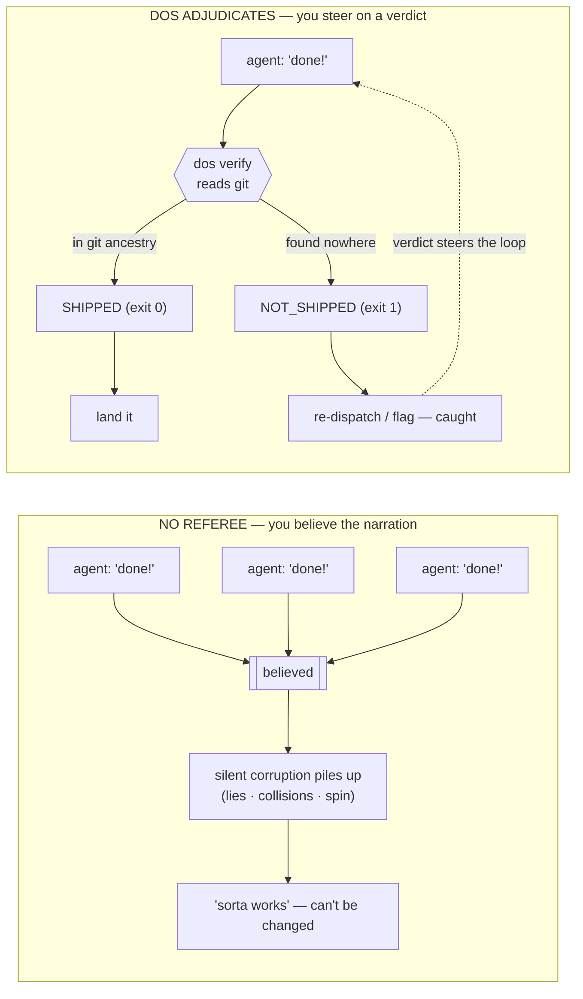

# DOS — the Dispatch Operating System

> ### Catch your AI agents when they lie about what they shipped.

<!-- PyPI / Python-version badges land with the PyPI release — until dos-kernel is
     on PyPI they'd render broken (404 / unknown version). -->
[](https://github.com/anthony-chaudhary/dos-kernel/actions/workflows/ci.yml)
[](LICENSE)

<p align="center">
  
  <br>
  <em>Run a fleet of agents on one repo. The left loop just feels like progress; the right one you can steer.
  The only difference is a verdict DOS reads from the real world — here, git — never the agent's word.</em>
</p>

**An AI agent will tell you it finished. DOS checks the real world instead of
taking its word** — and the nearest piece of the real world is your git history.

That's the whole idea. An agent says it shipped the login endpoint. Did it? You
run one command — `dos verify` — and it answers from the **artifacts the work
actually left behind** (here, git history), not from what the agent typed. If a
commit backs the claim, you get `SHIPPED` and exit code `0`. If nothing landed,
you get `NOT_SHIPPED` and exit code `1`. The agent's story never enters into it.
(Git is just the first witness DOS reads; the file tree, the clock, a CI status, a
test environment's own state are others — anything the agent didn't author.)

```bash
dos verify AUTH AUTH1   # → SHIPPED      AUTH AUTH1 e62f74d   (exit 0)
dos verify AUTH AUTH2   # → NOT_SHIPPED  AUTH AUTH2           (exit 1)
```

That's the smallest version. It scales up too: point a dozen agents at one repo —
in CI, in a fleet, racing on the same files — and DOS also tells you which ones
are **stepping on each other**, which one is **spinning in circles**, and which
claim of "done" is **real**. Every answer comes from the artifacts (git, the file
tree, the clock), never the narration. It works on a plain `git` repo with **zero
config**, and the only thing you ever have to install is one small Python package.

> ⏱️ **Want to try it right now?** Jump to **[Try it in 60 seconds](#try-it-in-60-seconds)**
> — one command, real output, then come back for the why.

<sub>**v0.22.0** · 3900+ tests · CI: Python 3.11–3.13 on Linux + a Windows 3.13
smoke run · the only runtime dependency is **PyYAML** · **MIT**.</sub>

<details>
<summary><strong>The 30-second mental model</strong> (one paragraph, plain words) — click to expand</summary>

> Coding agents narrate everything: *what they shipped, which files they touched,
> whether they're still making progress.* DOS treats all of that as a **claim**, not
> a fact, and hands you a **verdict** built from what actually happened. Under the
> hood it's a small, deterministic **kernel** — the part that decides ground truth
> across a crowd of unreliable workers and keeps their edits from colliding. Nothing
> about it is coding-specific: your repo declares its own rules (which file regions
> each agent may touch, how a commit signals "done") as data in one `dos.toml`, and
> the kernel supplies only the machinery. You reach that machinery through small,
> do-one-thing commands — `verify`, `arbitrate`, `liveness`, `refuse` — from the
> `dos` CLI, an MCP server wired into the agent host you already run, or straight
> from Python.

</details>

> **Reading this as an AI agent?** Start with **[AGENTS.md](AGENTS.md)** — a short
> orientation written for you: what DOS is in three lines, how to build/test/check
> your work, the ~5 files actually worth reading, and the architecture rules a
> change must satisfy.

## Try it in 60 seconds

Got 60 seconds and a terminal? Run the whole aha-moment in a throwaway repo. This
one command scaffolds a repo, makes a real commit, verifies it, and cleans up
after itself:

```bash
git clone https://github.com/anthony-chaudhary/dos-kernel.git && cd dos-kernel
pip install -e .            # from the clone — PyYAML is the only runtime dep
dos quickstart              # → SHIPPED AUTH AUTH1 … then NOT_SHIPPED AUTH AUTH2
```

That's it. One `SHIPPED`, one `NOT_SHIPPED` — the first is a claim git can back,
the second is a claim nothing landed for. **That contrast is the whole product in
one command.** The demo closes with a router to wherever you already run agents —
a Claude Code / Cursor tab (`dos init --hooks`), an MCP host, a CI step, or a
fleet — so your next move is one line, not a docs dig. (Add `--keep ./demo` to
keep the repo and poke at it. No clone wanted? `uvx --from
git+https://github.com/anthony-chaudhary/dos-kernel dos quickstart` runs the same
demo ephemerally — nothing left behind.)

<details>
<summary><strong>Prefer to watch the gears turn?</strong> The same thing, by hand, in 5 lines — click to expand</summary>

A *plan* (`AUTH`) groups *phases* (`AUTH1`, `AUTH2`); `dos verify` takes
`<plan> <phase>`, and a commit whose subject starts `AUTH1:` is what stamps that
phase shipped.

```bash
mkdir hello-dos && cd hello-dos
dos init .                                       # writes one dos.toml
git init -q
git config user.email you@example.com            # skip if you have a global git identity
git config user.name  "You"
echo 'def login(): ...' > login.py
git add -A
git commit -m "AUTH1: ship the login endpoint"   # stamp AUTH1 shipped: <PHASE-ID>: <message>

dos verify --workspace . AUTH AUTH1   # → SHIPPED     AUTH AUTH1 e389e8b (via grep-subject)   exit 0
dos verify --workspace . AUTH AUTH2   # → NOT_SHIPPED  AUTH AUTH2          (via none)          exit 1
```

An agent can **claim** `AUTH2` is done all day long; `verify` just reports what the
artifacts say — and they say it isn't. The `via grep-subject` / `via none` tag tells
you *how it knows*: it found the phase token in a commit subject, or it found it
nowhere. The full walkthrough is in **[docs/QUICKSTART.md](docs/QUICKSTART.md)**.

</details>

<p align="center">
  
  <br>
  <sub><em>The money-moment: two equally-confident claims, one verdict each — <code>SHIPPED</code> for the one git can back, <code>NOT_SHIPPED</code> for the one nothing landed for. Every string is verbatim output of <a href="examples/demo/verify_demo.sh"><code>examples/demo/verify_demo.sh</code></a>. <a href="examples/demo/verify_visual.html">Step through it locally</a> for the click-through version (it's an HTML file — clone the repo and open it in a browser; GitHub shows its source, not the running page).</em></sub>
</p>

**The smallest real win:** in a CI step or dispatch loop, replace the line that
trusts an agent's "done" with `dos verify PLAN PHASE` and branch on its exit code
(`0` shipped / `1` not). No parsing, no plan, no config — the
[CI integration cookbook](examples/playbooks/cookbook-ci-integration.md) walks it
end-to-end. To run it on a repo shaped like yours, start with
[Onboard a repo in 10 minutes](examples/playbooks/01_onboard-a-repo.md).

## What goes wrong in a fleet — and what catches it

Now the *why*. Run a pile of agents at once with nobody refereeing, and here's how
it goes. Each worker reports its own success, and you believe the reports — what
else is there to go on? Meanwhile the unchecked problems pile up quietly: a lie
here, two agents clobbering the same file there, a little scope-creep, one worker
spinning in circles. Eventually the codebase *sorta* works and nobody can safely
change it.

The trouble is you launched the agents, they graded their own homework, and you
have no signal you trust to steer on. DOS gives you that missing signal — a verdict
from ground truth — so the loop closes. Here is the same fleet under both regimes:

<details open>
<summary>The two regimes as a flowchart — <strong>left:</strong> you believe the narration; <strong>right:</strong> you steer on a verdict</summary>



</details>

Here are the failures a fleet actually produces, each next to the ground truth
that quietly contradicts the worker's story — and the verdict DOS hands back:

| A worker… | …but the ground truth is | DOS verdict |
|---|---|---|
| says it shipped a unit of work | no commit ever landed | `verify` → **caught lie** |
| tried, but the commit silently failed | no commit ever landed | `verify` (the flake — indistinguishable from a lie *without* git) |
| edits files another worker owns | two agents, one shared file | `arbitrate` → **refuse** the second |
| overruns the file region it claimed | footprint reaches beyond the declared tree | `scope-gate` → **REFUSE** (before the write lands) |
| reports "making progress" | 0 commits, only a fresh heartbeat | `liveness` → **SPINNING** |

Pause on the first row — it's the most common one. The classic tell is a cheerful
one-liner, *"all work completed!"*, from a worker that did little or nothing. DOS
never reads that line; it reads the ground truth, so the claim collapses the instant
no artifact backs it (more in [docs/108](docs/108_the-cheap-lie-and-the-narration-taxonomy.md)).
That's what makes it cheap to adopt: `verify` needs **no plan, no registry, no
config**, and **the exit code _is_ the verdict** — any shell or CI step can branch
on it without parsing a word.

<sub>*Prefer to watch it move?* The two loops are also a self-contained animation you
step through one frame at a time — clone the repo and open
[`docs/assets/loop_visual.html`](docs/assets/loop_visual.html) in a browser. (It's an
HTML file, so GitHub shows its source rather than running it — open it locally.)</sub>

### How far you take it — one slope, not a menu

**It works on a plain `git init` with zero config, and gets smarter the more you
tell it.** You don't adopt a framework and pick a tier; you start at the shallow
end and it keeps paying off as you wade deeper — the same kernel the whole way:

- **Zero config.** Point `dos verify PLAN PHASE` at a plain git
  repo — no plan, no registry, no `dos.toml`. It answers from commit history
  alone (`via grep-subject` / `via none`). This is the whole of
  [QUICKSTART](docs/QUICKSTART.md) and the day-one CI win above.
- **Tell it your structure.** `dos init` writes a `dos.toml` (lanes, paths,
  ship grammar as data); add a **plan doc** and `dos plan` lays each phase's
  *claim* beside the oracle's verdict. Here's [exactly what a plan file looks
  like](examples/plans/example-plan.md) (copyable, round-trips with the built-in
  reader), and four worked [example workspaces](examples/workspaces/).
- **Teach it your own types.** Declare your own block reasons, gate
  verdicts, output renderers, admission predicates, a model-backed **judge**, a
  custom **plan dialect**, or a whole host **driver** — all as workspace policy,
  never a fork. The map is **[docs/HACKING.md](docs/HACKING.md)** (seven extension
  axes) + the copy-me **[`examples/dos_ext/`](examples/dos_ext/)**.

### How you plug it in — pick the surface, not a rewrite

That slope is *how deep* your config goes. The other axis is *how you call the
referee at all* — and you adopt through whichever surface matches how you already
work, not by restructuring your stack. The same kernel verdicts are reachable
through every surface below, lowest-friction first:

| Surface | Adopt it when… | The move |
|---|---|---|
| **MCP server** | you drive an agent through an MCP host (Claude Desktop, Cursor, Cline, an Agent-SDK app) | add one line to the host config (`{ "command": "dos-mcp" }`) and ask the agent to `dos_verify` its own last claim — **zero code**. The *advisory* path (the agent asks). See [Give your agent a lie detector](#give-your-agent-a-lie-detector-mcp). |
| **Runtime hooks** | you run an agent loop (Claude Code, Cursor, Codex CLI, Gemini CLI) and want the verdict to *act*, not just be available | `dos init --hooks <runtime>` wires the verdict into that host's own hook config — a refused call is **denied before it runs**, a false "done" is **refused**. The *enforcement* path (the host denies). One command, no hand-edited YAML. See [QUICKSTART](docs/QUICKSTART.md) + [docs/221](docs/221_the-cross-vendor-hook-installer.md). |
| **CLI exit-code** | you have a shell pipeline or CI step that trusts an agent's "done" | replace that step with `dos verify PLAN PHASE` and branch on the exit code (`0` shipped / `1` not) — **the verdict *is* the exit code**. The day-one win above. |
| **Python API** | your dispatcher/orchestrator is already Python | `import dos` and call the pure syscalls (`dos.oracle.is_shipped`, `dos.arbiter.arbitrate`, …) — state-in / verdict-out, no subprocess. The [Python cookbook](examples/playbooks/cookbook-python-api.md). |
| **Fleet framework** | your fleet already runs on LangGraph, CrewAI, AutoGen, or the OpenAI/Claude Agents SDK | bolt the referee onto the framework's own seam — a referee node, a termination condition only git can satisfy, an output guardrail with a git tripwire. One function, no rewrite; every seam executed against the real framework. The [fleet-framework cookbook](examples/playbooks/cookbook-fleet-frameworks.md). |
| **Swarm runtime** | your agents run on **Hermes, OpenClaw**, or a SwarmClaw-style autonomous swarm — privileged tools, shared memory docs / task boards, and **no lock manager** for either | drop a two-function adapter into the tool-execution loop: `guard_action` refuses an arbitrary-exec command **before it runs**, and `acquire_lease` / `release_lease` bracket each shared-state write so the lost update never lands. No `import dos` — it shells the CLI; Hermes' `pre_tool_call` hook also speaks DOS natively (`dos hook pretool --dialect hermes`). The runnable, A/B-measured [Hermes / OpenClaw worked example](examples/hermes_integration/) + [docs/278](docs/278_integrating-dos-with-hermes-and-openclaw-the-missing-lock-manager-for-agent-swarms.md). |
| **Skill pack** | you run agents in Claude Code and want the workflow, not just the verdict | `dos init --skills` drops editable `SKILL.md` screenplays that wire the syscalls into a snapshot → audit → gate → take-a-lane loop. See [QUICKSTART §2](docs/QUICKSTART.md). |
| **Driver** | your lanes must be *computed*, or you add a provider-backed judge | write one `dos/drivers/<host>.py` (a `LaneTaxonomy` + a config factory), loaded by name, never imported by the kernel. The map is [HACKING.md](docs/HACKING.md). |

The two axes are independent: a zero-config repo can adopt through any surface, and
a deeply-configured one still answers over the same CLI and MCP tools. Start at the
top row — it's the one that costs nothing to try. The first two rows compose:
**MCP advises** (the agent checks its own work), **hooks enforce** (the host stops a
bad action) — wire both for the full loop.

Those surfaces are the **upstream half of the value chain** — who calls the
referee. The same verdicts also flow **downstream**, to the systems that act on
them: every adjudication lands in a verdict journal that `dos export` drains to
your observability stack (Datadog / Honeycomb / Grafana —
[docs/266](docs/266_the-verdict-exporter-shipping-the-journal-to-where-dashboards-live.md)),
`dos notify` pushes what-needs-a-human to Slack, `dos reward` gates what a
fine-tune may train on, and `dos attest` mints a signed receipt a skeptic can
check without loop access
([docs/246](docs/246_dos-attest-the-portable-signed-receipt.md)). One kernel, one
verdict vocabulary, from the agent's tool call to your dashboard.

## Why not just run N agents?

Fair question — why add a referee at all? Because N agents with no referee is that
**open loop** again: you launch them, they self-report, and you've got nothing
solid to steer on. DOS hands you that missing signal. Specifically, it gives you
**sensors** —

- `verify` — did it really ship? (from git, not the agent's word)
- `liveness` — is it ADVANCING, or just SPINNING / STALLED?
- `scope-gate` — did it stay in its lane? A **binding pre-effect** gate
  (`dos scope-gate`, ALLOW/REFUSE, exit 0/5/6) over the same `dos.scope`
  classifier that also reports post-hoc.

— and **actuators**: `arbitrate` (let this lane in, or refuse the collision) and
`refuse` (say no with a reason a machine can act on). Together they turn a pile of
workers into something you can actually drive. The kernel's job is the **signal**,
but it also ships a reference supervisor to show what you do with it: `dos watch`
checks `liveness` on each tracked run and *proposes* a halt when one spins or
blows its budget — it recommends, it never pulls the trigger — and `dos loop`
keeps N dispatch-loops alive. Use those, or build your own on the same signal.
Either way, it's the difference between *"I launched 20 sessions and I'm hoping"*
and *"I can see which two are lying and which one is wedged."*

You see that signal through **three read-only screens** — `dos top` (what's
running), `dos decisions` (what's waiting on you), `dos plan` (claim vs. ground
truth) — covered in [Three live projections](#three-live-projections-read-only-tuis)
below and walked end-to-end in
**[Debug a stuck fleet](examples/playbooks/06_debug-a-stuck-fleet.md)**.

The referee grows along **two axes**: deterministic *verdicts* that read artifacts
(`verify`, `liveness`, `scope`), and provider-backed *judges* — a model, a debate
— that rule on what no deterministic check can, kept outside the kernel under a
discipline that stops a wrong judge from clearing a falsehood. See
**[the adjudicator-population note](docs/88_the-adjudicator-population.md)** for
that scalable-oversight story in code.

> **We caught ourselves doing the exact thing DOS exists to catch.** A design doc
> in this repo included a small worked example — "here's what this snippet prints" —
> written by the agent building DOS. It read perfectly plausible. It was reviewed. It
> was committed. And it was **wrong**, for the dullest possible reason: *nobody had
> actually run it.* The agent had reasoned out what the code "would" print and typed
> that down as fact. An adversarial review later did the one thing the author hadn't
> — **executed the snippet** — and the real output flatly contradicted the prose.
> That's the whole thesis in one anecdote: **a confident narration is not evidence,
> even when the narrator is us, even after a human reviewed it.** The reasoning felt
> like checking; it wasn't. The only thing that settled it was running the code and
> reading what came back — an independent witness, exactly the move `verify` makes
> against an agent's "done." The correction is pinned in git (`docs/124`, commit
> `651ba03`), because here too the record is the commit, not the claim.

## What's proven — and what's still a bet

We apply the same honesty to our own claims that the kernel applies to your agents.
It would be easy to lead with one big number; instead, here's the honest split —
**what we actually measured, what we extrapolated from those measurements, and what
is still a bet.** Draw the line yourself. (Every *proven* number is from a live,
re-runnable benchmark written up under [`benchmark/`](benchmark/) and the paper.)

**✅ Proven — measured in live runs, scored against a fact the agent can't fake**
(a test environment's database state, git history — bytes the agent wrote none of):

- **It catches the lie and blocks it.** Across **120 clean tasks** on a standard
  agent benchmark, a DOS gate caught **10 genuine "I shipped it" lies** and let
  every honest write through — at the same **8.3% catch rate on both a mid-size and
  a top-tier model.** The signal doesn't fade when you upgrade the model. (Over the
  full benchmark: 15 lies caught in 258 tasks, two models, **zero false alarms**.)
  *(▶ the money-moment is the [gate figure below](#the-two-money-moments-rendered).)*
- **It prevents the collision.** The same referee put two live agents on one shared
  record and stopped **6 of 8** cases of one silently overwriting the other — **4 of
  6** when the cases were drawn from the real task mix. This is the half a sandbox
  *can't* cover: an isolated workspace still shares the outside world.
  *(▶ the collision being prevented is the [coordination figure below](#the-two-money-moments-rendered).)*
- **Mid-run "fixes" don't help; quitting a doomed run does.** Every active fix we
  tried mid-run (warn it, rewind it, inject a hint) came out flat-to-negative —
  poking a run also disturbs the ones that would have passed. The one move that
  helps writes nothing: **give up at the right moment** — 0 runs wrongly killed out
  of 1,634 winners across 22 models, ~11% of fleet compute saved.
- **The training label can't be gamed.** For "may a fine-tune learn from this run?"
  (`dos reward`), the yes/no is computed from environment state the agent authored none of — so no
  amount of clever output text can flip a *no* to a *yes*. That's a proof, plus a
  measured **60% → 100% precision** lift from filtering out the poison a naive
  self-graded collector would have kept.

<a id="the-two-money-moments-rendered"></a>

The two proven moments above, each rendered as a single figure from its own live
run (every number, hash, and ID is a verbatim read-off — never a hand-typed
dramatization):

<p align="center">
  
  <br>
  <sub><em><strong>It catches the lie and blocks it.</strong> A confident booking, refuted by the DB-hash the agent couldn't author, blocked before a downstream agent inherits the phantom. <a href="benchmark/agentprocessbench/writeadmit/gate_visual.html">Step through it locally</a> (an HTML walkthrough — clone and open in a browser; GitHub shows its source).</em></sub>
</p>

<p align="center">
  
  <br>
  <sub><em><strong>It prevents the collision.</strong> A stale add-bag clobbers a cancellation under naive replay; the arbiter serializes the two agents on the same region so neither overwrites the other. <a href="benchmark/agentprocessbench/writeadmit/f2_visual.html">Step through it locally</a> (an HTML walkthrough — clone and open in a browser).</em></sub>
</p>

**📈 Projected — real measurements, composed into a curve (and labelled as one).**
Here's the honest crux: **catching a lie is only worth something to whoever can't
catch it themselves.** Hand the verdict to one strong agent that re-checks its own
inputs and it buys you almost nothing — that agent recovers on its own. Hand it to
something that *can't* re-check — a non-LLM system, a weaker model, a long
multi-step chain, or a training loop — and it pays off (up to a full +1.0 in our
no-recovery upper bound). In short: **DOS is worth more the less your downstream can
check itself.** Our fleet-scale figure (≈173–505 corrupted results prevented at a
32-agent fleet) projects these real per-run rates onto fleet math — it's geometry on
top of measured numbers, not a measured fleet run.

**🎲 A bet — stated as one.** Where this goes if the floor holds: a frozen,
cross-vendor **trust standard** (the "deny" message is already byte-identical across
Claude Code, Codex, and Qwen — a de-facto standard waiting to be named), a shared
**arbiter for real-world effects**, the claim-vs-reality **corpus** only a neutral
party can hold, and a **notary** that proves what an agent did *to a skeptic who
wasn't in the room* (the mechanism already ships — `dos attest` mints an
HMAC-signed receipt over an effect-witness verdict and `dos verify-receipt` checks
it with the shared key alone; [docs/246](docs/246_dos-attest-the-portable-signed-receipt.md)).
The seeds are in the tree; we claim no results for any of it.

> **The one distinction that keeps this honest:** a **J** is a *count of failures
> blocked off ground truth* — never a downstream outcome delta. "Blocked 10 real
> over-claims" is proven; "made the fleet 10% better" is not the same sentence, and
> we don't write it.

## What DOS does *not* do

The proven/bet gradient above is about *evidence*; this is about *capability* — the
boundaries are part of the contract, and stating them is the same honesty the
kernel applies to your agents:

- **It adjudicates that a ship *happened*, not that the code is correct or good.**
  `verify` reads git ancestry, so it catches "no commit landed," not "the
  committed work is wrong." Judging *quality* is the JUDGE / HUMAN rung, not the
  deterministic oracle.
- **It computes verdicts and admission decisions; it never spawns or kills an OS
  process.** `liveness` is advisory — it *reports* SPINNING, it doesn't stop the
  run — and `dos loop` *emits* a spawn/reap/flag plan you act on. (`arbitrate` and
  `refuse` are decisions you enforce, not force the kernel applies.)
- **It is not a CI replacement or a test runner.** It sits *beside* them and lets a
  step branch on the exit-code verdict.
- **The pluggable verdict/JUDGE adjudicator *registry* is specced, not yet
  shipped** (see [docs/88](docs/88_the-adjudicator-population.md) §5); the JUDGE
  *seam* and built-in judges are.

## Give your agent a lie detector (MCP)

The easiest way in doesn't involve writing any Python. Point the agent host you
already use at the bundled **MCP server**, then ask your agent to `dos_verify` its
own last claim. The first time it comes back `NOT_SHIPPED … (via none)` on work the
agent *swore* it finished, the whole point of this repo clicks into place — in your
terminal, on your fleet.

Installed with the `[mcp]` extra (`pip install -e ".[mcp]"` from your clone — see
[Install](#install)), DOS exposes the syscalls as **MCP tools** — the truth tools first (`dos_verify` "did it ship?",
`dos_commit_audit` "does this commit's claim match its diff?", `dos_status` one
folded fact about a run), then `dos_arbitrate` (may two workers run without
colliding?), the structured-refusal pair (`dos_refuse_reasons` / `dos_check_reason`),
`dos_recall` (is this recalled memory still true?), and `dos_doctor` (the workspace
report) — so any MCP-speaking host — **Claude Desktop, Cursor, Cline, an Agent-SDK
app** — can call the referee over JSON-on-stdio with **zero Python coupling**. Each
verdict comes back with a one-line interpretation of what it means for the agent's
next move. (See **[the MCP server surface](docs/80_mcp-server-surface.md)**.)

```jsonc
// claude_desktop_config.json — paste, restart, then say:
//   "use dos_verify to confirm you actually shipped that"
{ "mcpServers": { "dos": { "command": "dos-mcp" } } }
```

The MCP server is **advisory**: the agent *calls* the referee when it (or you) thinks
to. The per-host wiring for Cursor / Codex / Gemini is in
**[the MCP README](src/dos_mcp/README.md)** — all four are MCP clients, so this works
on every one of them with zero code.

### …then make the verdict *act* (hooks)

To go from "the agent can ask" to "the host won't let a bad call through," wire DOS's
**hooks** into the runtime you actually run. One command per host — it writes that
host's own hook-config file, merged into anything already there:

```bash
dos init --hooks claude-code .   # .claude/settings.json
dos init --hooks cursor .        # .cursor/hooks.json
dos init --hooks codex .         # .codex/config.toml
dos init --hooks gemini .        # .gemini/settings.json
dos init --hooks antigravity .   # .agents/hooks.json
```

That binds three shipped hooks: **`pretool`** denies a structurally-refused call
before it runs, **`stop`** refuses a stop on an unverified "done," **`posttool`**
re-surfaces a stalled stream. This is the **enforcement** path (the *host* denies on a
DOS verdict) — the complement to MCP's advisory path. Until recently this spoke only
Claude Code; it now installs across five hosts — Claude Code, Cursor, Codex, Gemini,
and Antigravity ([docs/221](docs/221_the-cross-vendor-hook-installer.md),
[docs/269](docs/269_antigravity-the-fifth-host.md)).
`--with-hooks` is the back-compat alias for `--hooks claude-code`.

Under the installer sits a pluggable **dialect seam**: the verdict is decided
once, then rendered into whatever JSON shape the host parses
([docs/217](docs/217_the-cross-vendor-hook-dialect-seam.md)) — so a runtime the
installer doesn't cover yet can still consume the same hooks. A sixth shipped
dialect speaks **Hermes**: `dos hook pretool --dialect hermes` emits the
`{"decision": "block", "reason": …}` object Hermes' `pre_tool_call` shell hook
reads (wire it in `cli-config.yaml`). A new host's dialect is a driver, never a
kernel edit.

Because these hooks run on **every** tool call, the core kernel logic on the hot path is
reimplemented in **native Go** — a `dos-hook` binary that ports the actual decision
predicates (the conjunctive-only lease-admission and prefix-disjointness floor, the
`verify()` grep rung, self-modify, the marker budget, the WAL) rather than just shelling
out to Python. It is **highly performant**: it serves the per-call verdict in ~10 ms —
**16–43× faster** than shelling `python -m dos.cli hook …` (~0.25–0.8 s, dominated by
interpreter cold-start) — and is **byte-identical** to the Python kernel on the gated
decision (the docs/124 parity contract, pinned by Go parity tests). It owns the common
fast path and falls back to the always-available Python verb for anything it doesn't yet
serve, so a machine without the binary degrades cleanly with no wiring change
([docs/125](docs/125_go-hook-fastpath-build-plan.md),
[docs/270](docs/270_go-hook-fastpath-benchmarks.md)). You don't build it yourself:
the per-platform wheels bundle the binary, so a wheel install gets the native fast
path with **no Go toolchain** — and any platform without a bundled binary (including
a plain source install) just runs the pure-Python path
([docs/286](docs/286_shipping-the-go-binary-through-pypi-per-platform-wheels.md)).

## The syscall ABI

Every syscall answers a question you'd otherwise have to *take the agent's word
for*. "Reach for this when…" is the plain-English trigger; the rest is the
contract — and the module names are auditable.

| Syscall | Reach for this when… | What it is | Module |
|---|---|---|---|
| `verify()` | an agent says a unit of work is **done** and you don't want to take its word | the **truth syscall** — "did (plan, phase) actually ship?" registry-first, ancestry-checked, from git history if there's no plan at all | `dos.oracle`, `dos.phase_shipped` |
| `liveness()` | a long run says it's **"making progress"** and you want to know if it actually is | the **temporal verdict** — "is the run ADVANCING, or just SPINNING / STALLED?" from the git/journal delta and the clock | `dos.liveness` |
| `verify-result()` | a **subagent hands a result back** to an orchestrator that folds it as a finding — but the result string may be a harness-synthesized error the worker never authored | the **fold-site result-state witness** ([docs/197](docs/197_how-dos-is-directly-useful-to-ultracode.md)) — classifies a subagent transcript's terminal record, gating on `message.model == "<synthetic>"` (the unforgeable harness-authorship marker), never the agent's self-report; **exit 3 = DEAD** (a harness 429 / quota / auth / server error), `0` = HEALTHY / UNREADABLE | `dos.result_state` |
| `resume()` | a run **died or paused mid-flight** and you need to continue without re-doing work or double-applying it | the **third ARIES phase** — "how far did the *fossils* say it got, and what's the residual?" over a run-id-keyed intent ledger; re-enters from a git-VERIFIED SHA, never the dead run's self-report (RESUMABLE / COMPLETE / DIVERGED / UNRESUMABLE) | `dos.resume`, `dos.intent_ledger` |
| `complete()` | you need to know if the **whole declared job** is verifiably done, not just one phase | the **completion verdict** — `residual = declared − verified`, asked forward; read-only, never self-certifies | `dos.completion` |
| `rewind()` | a run thrashed and you want to **excise the dead-end turns** without the kernel authoring a correction | the **conversation-rewind verdict** — replays the ledger for a minted checkpoint and PROPOSES the excision (never truncates; the host owns the transcript) | `dos.rewind` |
| `productivity()` | a long run is burning turns and you want to know if it's **still doing work, or fading** | the **loop-economics verdict** ([docs/218](docs/218_the-productivity-verdict-diminishing-returns-as-a-syscall.md)) — `classify(work-deltas) -> PRODUCTIVE / DIMINISHING / STALLED` over a trend of per-step work; pure, no I/O | `dos.productivity` |
| `efficiency()` | you want to know if the **tokens a run spent actually bought work** (a run can be productive yet burn 10× its work's worth) | the **token-effectiveness verdict** ([docs/263](docs/263_token-effectiveness-verdict-plan.md)) — `work / tokens -> EFFICIENT / COSTLY / WASTEFUL`; both counts are env-authored, so a run can't narrate its way to EFFICIENT | `dos.efficiency` |
| `improve()` | a **self-improving loop** proposes a change to its own code and you must decide **keep or revert** — without trusting the loop's own claim that it helped | the **keep-gate** ([docs/280](docs/280_the-self-improving-work-loop-the-kernel-adjudicates-its-own-improvement.md)) — `KEEP / REVERT / ESCALATE` from witnesses the candidate's author didn't write: the suite green on the candidate-only tree, the truth syscall clean, and a strictly-measured metric gain; a regression always REVERTs, a run of non-keeps ESCALATEs to a human | `dos.improve` |
| `reward()` | a fine-tune is about to **train on an agent's trajectory** and the "it worked" label came from the agent itself | the **reward-set admission verdict** ([docs/230](docs/230_the-lab-facing-twin-rlvr-admit-the-non-distillable-reward-label.md)) — `ACCEPT / REJECT_POISON / ABSTAIN` off a witness the agent authored zero bytes of, so no answer text can flip a reject to an accept (the non-distillable label) | `dos.reward` |
| `breaker()` | a **failure class keeps tripping** and you want to stop retrying and escalate | the **circuit-breaker primitive** ([docs/223](docs/223_the-circuit-breaker-primitive-failure-counting-as-mechanism.md)) — a pure two-counter state machine, `CLOSED / OPEN`, tripping on consecutive *or* total failures; an OPEN verdict names the escalation rung (none / judge / human) | `dos.breaker` |
| `hook_exit()` / `exec_capability()` | you wire a **plain shell hook** into a runtime, or need to know if a command **grants arbitrary code execution** | two classifier leaves the cheapest integrations consult — `hook_exit` maps an exit code to an intervention ([docs/226](docs/226_the-hook-exit-classifier-a-shell-scripts-exit-code-as-a-verdict.md): 0 pass / 2 BLOCK / other WARN), `exec_capability` classifies the *invoked program token* — never a substring — as `GRANTS_ARBITRARY_EXEC / BOUNDED` ([docs/224](docs/224_the-exec-capability-classifier-a-shape-not-a-word.md)) | `dos.hook_exit`, `dos.exec_capability` |
| `refuse(reason)` | you need to say **why** a pick was blocked in a way a machine can act on | **structured refusal** — a closed, declared reason vocabulary (`dos.reasons`, extensible per-workspace), every reason emittable, verifiable, and refusable | `dos.wedge_reason`, `dos.picker_oracle` |
| `lease()` / `arbitrate()` | two agents might **touch the same files** and you need to admit one without a collision | the **pure admission kernel** — `arbitrate(request, live_leases, config) -> decision`, state-in / decision-out, no I/O | `dos.arbiter` |
| `spawn()` / `reap()` | you need every run to carry a **traceable identity** and its effects to be replayable | the **correlation spine** (sortable, lineage-carrying run-ids) + the lease **write-ahead log** | `dos.run_id`, `dos.lane_journal` |
| `enumerate()` / `pickable()` / `cooldown()` / `reconcile()` | an unattended loop must know **is there anything pickable, why-not, have I tried it, and did the claim hold?** — without re-storming a known drain or believing a "done" the git can't confirm | the **picker substrate** ([docs/207](docs/207_dispatch-workflow-extraction-and-the-pickable-substrate-completion.md)) — `enumerate` is the phase-list producer (the `declared` set, never a silent empty); `pickable` the pre-dispatch gate (OFFERABLE / HELD(reason)); `cooldown` the anti-churn fold over pick-attempts (CLEAR / RECENTLY_ATTEMPTED); `reconcile` the quiet-completion join (VERIFIED / QUIET_INCOMPLETE / HONEST_OPEN, fail-closed on the claim) | `dos.enumerate`, `dos.pickable`, `dos.cooldown`, `dos.reconcile` |

> Three terms the table assumes: a **plan** (e.g. `AUTH`) groups **phases** —
> a phase is a named unit of work (e.g. `AUTH1`); a **lane** is a leased region of
> the file tree an agent works in. All are defined in the
> [quickstart](docs/QUICKSTART.md).

> **The newest catch — a result that *died*.** When a subagent hands a result
> back to an orchestrator that folds it as a finding (an ultracode `Workflow`, an
> Agent-SDK fan-out), the result string itself may be a **harness-synthesized
> error** the worker never authored — and ~32% of real subagents return exactly
> that (a 429 / quota / auth string) where the fold expects a finding ([docs/197](docs/197_how-dos-is-directly-useful-to-ultracode.md)).
> `verify-result` reads the transcript's terminal record and refuses to believe a
> harness-authored death:
>
> ```bash
> dos verify-result --transcript dead.jsonl
> #   DEAD SYNTHETIC class=OTHER — harness-authored terminal
> #   (model=<synthetic> + stop_reason=stop_sequence) — not a finding; route to DEAD, do not fold
> echo $?   # → 3   (count it in the denominator; never bank it as a result)
>
> dos verify-result --transcript real.jsonl
> #   HEALTHY — terminal assistant record is real-model authored with content
> echo $?   # → 0
> ```
>
> It gates on `message.model == "<synthetic>"` — the marker the agent's own model
> *cannot forge* (the runtime harness authored those bytes, not the worker) — which
> is broader than rate-limits alone: quota, auth, and server deaths are caught too.

Around these sit ~30 supporting kernel modules — the file-tree disjointness
algebra, the timeline reader, the gate/loop classifiers, the typed-verdict
contract, the JUDGE-rung seam. The full map is in **[CLAUDE.md](CLAUDE.md)**.

## Install

Pick the row that matches how you work — the full matrix (every OS, every
channel, upgrade/uninstall, WSL, troubleshooting) is in
**[docs/INSTALL.md](docs/INSTALL.md)**:

```bash
# uv — the modern, fast, isolated CLI install (recommended), straight from GitHub:
uv tool install git+https://github.com/anthony-chaudhary/dos-kernel       # `dos` + `dos-mcp` on PATH
uvx --from git+https://github.com/anthony-chaudhary/dos-kernel dos doctor # or run it once, ephemerally

# pip — the library-consumer path (a host pins dos-kernel in its own venv):
pip install "dos-kernel @ git+https://github.com/anthony-chaudhary/dos-kernel"      # core kernel (PyYAML only)
pip install "dos-kernel[mcp] @ git+https://github.com/anthony-chaudhary/dos-kernel" # + the MCP server (dos-mcp)

# from a clone — editable, the contributor path:
git clone https://github.com/anthony-chaudhary/dos-kernel.git && cd dos-kernel
pip install -e .                  # editable: your edits are live in the install
./install.sh                      # or .\install.ps1 on Windows — venv + install + PATH, one line
```

> **The distribution name is `dos-kernel`, not `dos`** — a bare `pip install dos`
> pulls an unrelated package that squats the name. The *import* name and the CLI
> are still `dos`. The **core kernel's only runtime dependency is PyYAML** (the
> `[mcp]` extra adds the MCP framework; `[tui]` adds the live `dos top` screens).
> See [SECURITY.md](SECURITY.md), "Supply chain."

Prefer a package manager? **uv** is the 2026 default — faster than `pipx`,
isolates the tool, and manages Python versions; `pipx install
git+https://github.com/anthony-chaudhary/dos-kernel` works the same way if your
team already uses it. PyPI / Homebrew / WinGet / Scoop one-liners are next on the
release runway (see [docs/INSTALL.md](docs/INSTALL.md)).

A host repo adds DOS as a pinned dependency and points it at its own tree — never
by vendoring the code in. DOS is **stateless about which repo it serves**: it
resolves the workspace from `--workspace` › `$DISPATCH_WORKSPACE` › cwd, never its
own install location, so the ground truth stays legible as the codebase grows.
(The full separation contract — mechanism in the package, policy in the
workspace's `dos.toml` — is in **[CLAUDE.md](CLAUDE.md)**.)

For most repos that one `dos.toml` is the whole policy surface — but when your
lanes must be *computed* (from runtime state, an env var, a monorepo manifest)
rather than listed, or you add a provider-backed JUDGE, you write a small
**driver** instead: a `dos/drivers/<host>.py` exposing a `LaneTaxonomy` constant +
a `<host>_config` factory, loaded by name via `dos --driver <host>` and never
imported by the kernel. Copy [`dos/drivers/workshop.py`](src/dos/drivers/workshop.py)
as the template; the full driver/plugin map is in **[docs/HACKING.md](docs/HACKING.md)**.

### Claude Code plugin — hooks + MCP + skills in one install

If you drive a fleet with **Claude Code**, the lowest-friction way to bind the
verdict to the runtime is the bundled plugin under
[`claude-plugin/`](claude-plugin/) — it packages all three runtime surfaces at once:

- the **hooks** (`PreToolUse` → deny a structurally-refused call · `PostToolUse` →
  re-surface a stalled tool stream · `Stop` → refuse to stop on an unverified
  claim) — all fail-safe (they emit nothing and exit 0 on any error, so they never
  break a turn);
- the **MCP server** (`dos_verify` / `dos_arbitrate` / `dos_commit_audit` /
  `dos_refuse_reasons` … as tools the model calls directly);
- the **generic skill pack** (the domain-free dispatch screenplays), namespaced as
  `/dos-kernel:dos-next-up`, `/dos-kernel:dos-dispatch`, …

```bash
# 1. The plugin ships JSON + markdown; the brains ship as the pip package, so
#    install it FIRST into the interpreter Claude Code runs (the [mcp] extra is
#    what the bundled MCP server needs):
pip install "dos-kernel[mcp] @ git+https://github.com/anthony-chaudhary/dos-kernel"

# 2. Then, inside Claude Code:
/plugin marketplace add anthony-chaudhary/dos-kernel
/plugin install dos-kernel@dos
```

After installing, run **`/dos-kernel:dos-setup`** once — it confirms the package is
importable, reports what the plugin wired, and points at the next skill. The same
three hooks are available à la carte via `dos init --hooks claude-code` (and for
Cursor / Codex / Gemini); the plugin is just the pre-packaged Claude Code form. The
bundle's design + the build that keeps its skills in lockstep with the source are in
**[claude-plugin/README.md](claude-plugin/README.md)**.

## CLI

One `dos` entrypoint over the syscalls (see [QUICKSTART.md](docs/QUICKSTART.md) for
a runnable tour of the core ones):

```bash
# --- the syscalls ---
dos verify PLAN PHASE                  # truth: did (plan,phase) ship? (works with no plan)
dos commit-audit [REF] [--sweep]       # truth: does a commit's SUBJECT match its own diff? (--sweep = drift rate over a range)
dos verify-result --transcript T       # fold-site witness: did a subagent's terminal record DIE (harness 429/quota)? (exit 3 = DEAD)
dos coverage --declared N              # fan-out coverage: how many of N declared workers REALLY returned a result vs died?
dos liveness --run-id R --start-sha S  # temporal: ADVANCING / SPINNING / STALLED?
dos resume --run-id R                  # the resume verdict: replay a run's intent ledger, re-verify against git, PROPOSE the continuation
dos complete --run-id R [--diverged]   # completion verdict: is the WHOLE declared job done? (residual = declared − verified)
dos rewind --run-id R [--fire SIGNAL]  # conversation-rewind verdict: PROPOSE excising dead-end turns (never truncates)
dos status --run-id R                  # the folded fact: one fail-closed digest of a run (liveness + verified progress + lease)
dos arg-provenance --tool T --args J [--new-key K]  # did the model MINT this id/FK, or RESOLVE it from env bytes? (exit 0 believe / 3 UNSUPPORTED)
dos arbitrate --lane L --kind K --leases '[…]'   # admission: may a lane start without collision?
dos scope-gate --lane L [--staged]     # binding pre-effect scope gate: may this PROPOSED write land in its lane? (ALLOW/REFUSE)
dos lease {acquire,release,status} OWNER         # the cross-process archive lock
dos lease-lane {acquire,release,heartbeat,live}  # durable lane lease over the pure arbiter (write-back to the WAL)
dos run-id mint PROCESS                # mint a correlation run-id
dos id-alloc {allocate,peek} SCOPE     # atomically allocate a never-reused, monotonic id for a scope
dos journal {tail,replay,seq,compact}  # the lane write-ahead log
dos halt --handle H                    # the reap verb: emit the stop-plan for a live run/lease
dos pickable / enumerate / cooldown / reconcile  # picker substrate: anything pickable? why-not? tried recently? did the claim hold?

# --- workspace & inspection ---
dos init [DIR]                         # scaffold a dos.toml workspace config
dos doctor [--json] [--check]          # report the active workspace + taxonomy + predicates
dos lint [--strict] [--json]           # dead policy in this workspace's own dos.toml? (unreachable lanes, dangling refs)
dos man {wedge,lane} [ID]              # the self-describing manual over the registries
dos exit-codes [VERB]                  # print the verdict-IS-the-exit-code table (all verbs or one)
dos gate PACKET                        # typed empty-packet verdict (LIVE/DRAIN/STALE-STAMP/…)
dos judge wedge RUN_TS                 # adjudicate a no-pick verdict (deterministic)
dos judge-eval --judge N --cases C     # score a JUDGE-rung adjudicator against labelled claims
dos overlap-eval --policy P --cases C  # score an overlap scorer by false-admit rate (the disjointness backtest)
dos intervention-eval --cases C        # score an intervention policy by NET task delta (not verdict accuracy)
dos tool-stream-eval --cases C         # score a stall-reader policy by NET recovery (not detection accuracy)
dos precursor-gate-eval --cases C      # score a precursor grammar by recall vs false-refute waste
dos memory {recall,verify}             # re-verify recalled agent-memory at read time (RECALL_FRESH/STALE/UNVERIFIABLE)
dos health --lane L                    # pre-dispatch lane-health gate (overlap + recurring-blocker → route)
dos scout                              # pre-dispatch chooser: pick the next activity before leasing a lane
dos trace RUN_ID                       # walk one run across spine + intent ledger + WAL + git, joined by run_id

# --- agent-host binding (Claude Code / MCP) ---
dos guard [--verify-on-stop] -- CMD…   # wrap a headless agent launch: inject the DOS MCP server (+ optional verify-on-stop Stop hook)
dos hook {pretool,posttool,stop}       # the live agent-host hook surface (PreToolUse deny / PostToolUse sensor / Stop verify)

# --- live projections (read-only TUIs) ---
dos top [--once] [--json]              # live fleet watchdog: lanes, leases, verdicts, commits
dos decisions [N]                      # the operator-decision queue (list + drill-in TUI)
dos plan [--once] [--json]             # work-terrain board: every phase, the plan's claim vs the oracle's verdict
dos watch --track R [--budget-ms M]    # the watchdog driver: poll liveness for tracked runs + propose halts on spin/hang
dos loop --target N [--watch] [--json] # supervisor (init/PID-1): keep N dispatch-loops alive — emits a spawn/reap/flag plan

# --- loop-economics & reliability verdicts (pure; exit code is the verdict) ---
dos productivity --deltas 5,3,1,0      # is the run still doing work? PRODUCTIVE / DIMINISHING / STALLED
dos efficiency --work W --tokens N     # did the tokens buy work? EFFICIENT / COSTLY / WASTEFUL
dos breaker --consecutive N --max-consecutive M  # has this failure class tripped? CLOSED / OPEN (+ escalation rung)
dos hook-exit --code N                 # map a shell hook's exit code → PASS / BLOCK / WARN
dos exec-capability --command "…"      # does this command grant arbitrary exec? BOUNDED / GRANTS_ARBITRARY_EXEC
dos improve --suite-passed --truth-clean --work W --baseline-work B  # self-improving loop: KEEP / REVERT / ESCALATE
dos reward --claim --witness {confirm,refute,none}   # may a fine-tune TRAIN on this trajectory? ACCEPT / REJECT_POISON

# --- observability: the verdict journal → your dashboards ---
dos observe [--run R] [--json]         # project the verdict journal: every kernel adjudication, folded by run/syscall/verdict
dos helped [--since TS] [--json]       # the operator rollup: how many things DOS productively caught for you
dos export [--to file|statsd|otlp] [--since SEQ]  # drain the journal outward (Datadog / Honeycomb / Grafana); null = report only
dos notify {decisions,top} [--notifier slack|webhook --channel NAME]  # push what-needs-a-human / what's-running to where the operator is; null = render only

# --- portable proof (third-party verifiable, no loop access) ---
dos attest --claim KEY {--accept-cmd CMD | --before P --after P}  # mint an HMAC-signed receipt over an effect-witness verdict
dos verify-receipt --receipt R         # the skeptic's side: check the signature with the shared key alone (fails LOUD on tamper)

# --- cross-project (machine-local index) ---
dos projects                           # the projects DOS has served
dos learn AXIS                         # aggregates over resolved decisions
dos reindex                            # rebuild the central store from the .dos/ dirs
```

Most verbs take `--workspace .` (or honor `$DISPATCH_WORKSPACE` / cwd) and
`--json` for machine-readable output. For verdict-bearing commands (`verify` /
`liveness` / `gate`) **the exit code is the verdict.** A pluggable `--output
<name>` renderer (the `dos.renderers` entry-point group) is covered in
[HACKING.md](docs/HACKING.md).

### Three live projections (read-only TUIs)

A fleet leaves its state scattered across git history, a write-ahead log, and a
pile of verdict envelopes. DOS folds that into **three read-only screens**, each
answering a different operator question. They are *projections*, not stores: every
one reads kernel state, **mutates nothing, takes no lease, launches nothing** —
delete any of them and you lose the screen, not the data. Pick by the question
you're asking:

| Screen | Answers | Reads |
|---|---|---|
| `dos top` | *What's **running** right now?* — the lanes, the leases holding them, recent verdicts, live git activity. The screen you leave open in a side terminal during a run. | leases (WAL) + per-lane `liveness` + verdict envelopes + git |
| `dos decisions` | *What's waiting on **me** right now?* — the no-picks (refusals, wedges, open gates) that need a decision, each tagged by *who can resolve it*. | the four refusal sources, joined |
| `dos plan` | *Does the plan's **claim** match the **ground truth**?* — every declared phase, the plan's self-reported status beside the oracle's verdict, so an over-claim is its own cell. | the plan source × `verify()` per phase |

In `dos top` a held lane's status chip **is** its `liveness` verdict — green
`ADVANCING` / yellow `SPINNING` / red `STALLED` — so "which one is wedged" is one
glance, not a log dig. `dos decisions` tags each row by resolver — a deterministic
**ORACLE** (may auto-clear), an **LLM JUDGE** (could rule before you spend
attention), or a **HUMAN** (a genuine operator call) — and on a keypress prints
the exact shell command and exits; *you* run it, the screen never mutates
substrate. `dos plan` is a `verify()` fan-out, **not** a plan reader: a human runs
it from *outside* the agent loop, so an over-claiming loop is caught by ground
truth, not by re-reading its own narration.

All three have a **plain-text floor that needs no dependencies** — the live
`rich` redraw is the optional `[tui]` extra, but `--once` (one frame) and `--json`
work on a bare core install (no extras). Here is `dos top --once` on a fresh
checkout (no leases yet, so every lane is `FREE` and the git strip carries the
content):

```text
┌─ dos top · /path/to/repo · 2026-06-07T17:14:32+00:00 ──────────────────────
LANES
   benchmark     ⚪ FREE
   docs          ⚪ FREE
   …                                  (one concurrent lane per source dir)
  *global        ⚪ FREE              (* = the exclusive whole-repo lane)
  8 lanes · 0 advancing · 0 spinning · 0 stalled · 8 free
RECENT VERDICTS        [trust = ship-oracle cross-check]
  (no verdicts yet)
RECENT COMMITS        [ground truth — git history]
  0857bd4    docs/206 Appendix A: the whole program in plain words
  …                                  (last 10 commits — the content even a
                                      zero-lease repo always has)
──────────────────────────────────────────────────────────────────────────────
read-only · q quit · this screen mutates nothing
```

The stuck-fleet walkthrough that drives all three end-to-end is
**[Debug a stuck fleet](examples/playbooks/06_debug-a-stuck-fleet.md)**.

<p align="center">
  
</p>

### Observability — the verdict journal, drained to where dashboards live

Those three screens read a fleet's *running* state. Underneath, every verdict the
kernel computes — each `verify` / `liveness` / `efficiency` / `breaker` / `reward`
/ hook decision — also lands in a **verdict journal**: a `run_id`-correlated
write-ahead log of the kernel's *own* adjudications
([docs/262](docs/262_the-verdict-journal-observability-as-a-first-class-surface.md)).
Two verbs make it useful. `dos observe` is the read-only projection — fold the
journal by run, syscall, or verdict, or replay one run's verdict history. `dos
export` is the **delivery seam**: it drains the journal outward to an
observability backend through the `dos.exporters` entry-point group, with three
shipped transports — `file` (JSONL), `statsd` (DogStatsD counters), and `otlp`
(OpenTelemetry log records → Datadog / Honeycomb / Grafana), the `null` default
reporting only ([docs/266](docs/266_the-verdict-exporter-shipping-the-journal-to-where-dashboards-live.md)).
So "how often did the fleet over-claim this week, and on which lanes?" becomes a
dashboard panel, not a log grep — and adding a transport is a driver, never a
kernel edit (the same kernel/driver split as judges and notifiers).

## Hacking it

DOS is built to be extended **without forking the package** — add your own block
reasons, gate verdicts, admission/safety predicates, output renderers (the
`dos.renderers` entry-point group), and your own **judge** for the JUDGE rung
(`dos.judges`, scored by `dos judge-eval`), all as *workspace policy*, not package
edits. The block-reason vocabulary is fully data-driven: declare a reason in four
lines of `dos.toml` and it becomes emittable, verifiable, refusable, and `dos man
wedge`-documented through the same kernel calls a built-in uses. See
**[docs/HACKING.md](docs/HACKING.md)** for the seven extension axes and the plugin
model, and **[`examples/dos_ext/`](examples/dos_ext/)** for a copy-me skeleton.

## Documentation

- **[docs/QUICKSTART.md](docs/QUICKSTART.md)** — runnable 5-minute hello-world. Start here.
- **[docs/README.md](docs/README.md)** — the docs index (guides vs. design notes
  vs. the dated build-journal; the numbers are chronology, not a reading order).
- **[docs/HACKING.md](docs/HACKING.md)** — extend DOS without forking it.
- **[CLAUDE.md](CLAUDE.md)** / **[CONTRIBUTING.md](CONTRIBUTING.md)** — the
  architecture contract and how to send a change.
- **[docs/releases/](docs/releases/)** — per-version release notes (the changelog).

## Playbooks & examples

**[`examples/playbooks/`](examples/playbooks/)** walks the syscalls end-to-end on
anonymized real-world repo shapes — every command was run and its output pasted
back verbatim:

- **[Onboard a repo in 10 minutes](examples/playbooks/01_onboard-a-repo.md)** —
  `pip install` → first verified ship, on any repo.
- Four archetypes — a [polyglot web-service fleet](examples/playbooks/02_polyglot-web-service.md)
  (concurrent lanes), an [OSS library release](examples/playbooks/03_oss-library-release.md)
  (the stamp grammar), a [data/ML pipeline](examples/playbooks/04_data-ml-pipeline.md)
  (liveness), an [infra monorepo](examples/playbooks/05_infra-monorepo.md) (refusals).
- [**Debug a stuck fleet** + FAQ](examples/playbooks/06_debug-a-stuck-fleet.md) —
  symptom → the one command that diagnoses it.
- Three cookbooks: [from Python](examples/playbooks/cookbook-python-api.md),
  [CI / MCP integration](examples/playbooks/cookbook-ci-integration.md), and
  [fleet frameworks](examples/playbooks/cookbook-fleet-frameworks.md) — LangGraph,
  CrewAI, AutoGen, the OpenAI/Claude Agents SDK — with every framework recipe also
  shipped as a runnable, suite-pinned file under
  [`examples/fleet_frameworks/`](examples/fleet_frameworks/).
- [**Wire DOS into a Hermes / OpenClaw swarm**](examples/hermes_integration/) —
  the offline, A/B-measured swarm-runtime example: the `exec-capability` gate
  refuses a prompt-injected command before it runs (real at a single agent), and
  the arbiter serves as the swarms' missing lock manager so the lost updates the
  runtime would silently incur drop to zero (value grows with fleet size; the
  honest K=1 falsifier is included). Both scoreboards read non-forgeable witnesses
  ([docs/278](docs/278_integrating-dos-with-hermes-and-openclaw-the-missing-lock-manager-for-agent-swarms.md)).
- Runnable [`examples/workspaces/`](examples/workspaces/) — `cd` in and run `dos`
  against a realistic lane taxonomy.

## Citation

The ideas here are written up in a paper — *"Verification Is All You Need — But
Not Where You Think"* — on the out-of-loop referee for agent fleets. A built PDF
lives at [`paper/releases/`](paper/releases/); the arXiv preprint is in
preparation. Until the arXiv ID lands, cite the repository:

```bibtex
@misc{dos_kernel,
  title        = {Verification Is All You Need --- But Not Where You Think},
  author       = {Chaudhary, Anthony},
  howpublished = {\url{https://github.com/anthony-chaudhary/dos-kernel}},
  note         = {DOS --- the Dispatch Operating System; arXiv preprint in preparation},
  year         = {2026}
}
```

## License

MIT — see [LICENSE](LICENSE).
