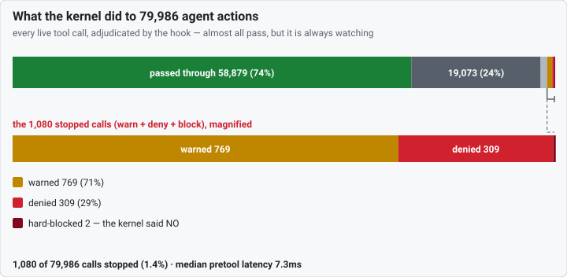
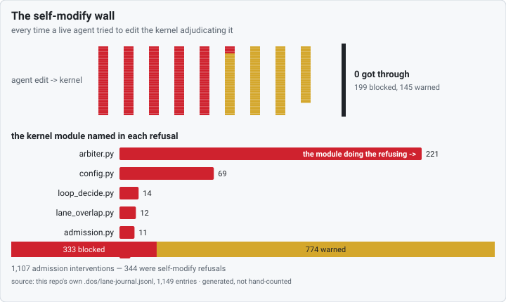
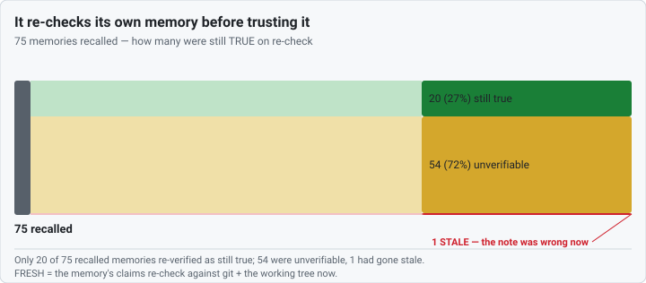

# What the kernel did — DOS by its own numbers

> **The kernel is the part that doesn't believe the agents.** These three
> pictures are that sentence in data — folded live from this repo's own `.dos/`
> journals, the per-call record every DOS hook and syscall writes as it runs.
> No figure is typed into the chart code: each SVG is a pure function of the
> fold, so the picture always matches the data, and it *grows* every time the
> kernel runs.

Regenerate all six assets (SVG + 2× PNG) from the current journals:

```bash
python scripts/kernel_charts_build.py
```

---

## 1. The disbelief funnel — what the kernel did to every agent action



Every live tool call an agent made, adjudicated by the hook. Almost all pass —
the kernel trusts the agents *almost* completely — but it is always watching,
and the tiny **stopped** slice (warn + deny + block) is real, not zero. It is
broken out and magnified at the bottom so the catch is visible without being
inflated: the funnel shows the true scale first, the magnifier second. Median
check overhead is single-digit milliseconds. Source:
`.dos/metrics/observations.jsonl`. `stopped` counts only the three intervention
outcomes — `override-admit` lets a call *through*, so it is deliberately
excluded.

## 2. The self-modify wall — agents kept trying to edit the kernel watching them



Every time a live agent reached to edit the kernel that adjudicates it, the
kernel refused — and **zero** got through. The ranked bar is which kernel
*module* each refusal named: the **arbiter** dominates, because
`arbiter.classify()` is the exact code that *emits* the refusal. Agents kept
reaching for the module doing the refusing. Source: `.dos/lane-journal.jsonl`;
a self-modify refusal is an entry whose `reason_class` is `SELF_MODIFY`, and the
per-module count is the guard quoting its own module — not a claim about agent
intent.

## 3. It doesn't even trust its own memory



A memory is a frozen past self-report — the least trusted signal in the stack.
So of the memories the kernel recalled, it re-checks each one against git + the
working tree *now* before believing it: only a fraction re-verify as still
**true**, most are unverifiable, and any that have gone **stale** are flagged
in red. Source: `.dos/verdict-journal.jsonl`, over `memory_recall` verdicts
only (`admit` verdicts excluded so the denominator stays "memories recalled").

---

## Methodology

Every number is folded live from this repo's own DOS artifacts and is never
written into the chart code — the builders (`scripts/kernel_charts.py`) take a
data dict from the fold (`scripts/kernel_metrics.py`) and emit a deterministic
SVG, so the figures change on each refresh as the kernel keeps running. The
SVGs are self-contained — no JavaScript, no `<style>`, no CSS variables, no
external fetch — so they render identically on GitHub Markdown and a Pages site,
and rasterize to PNG cleanly for image-only surfaces. `n` is shown on every
chart; these are one repo's local journals, not a population sample. The
companion [drift scoreboard](../../scoreboard/README.md) does the mirror job —
the same claim-vs-diff audit run across 19 popular AI-built repositories.
