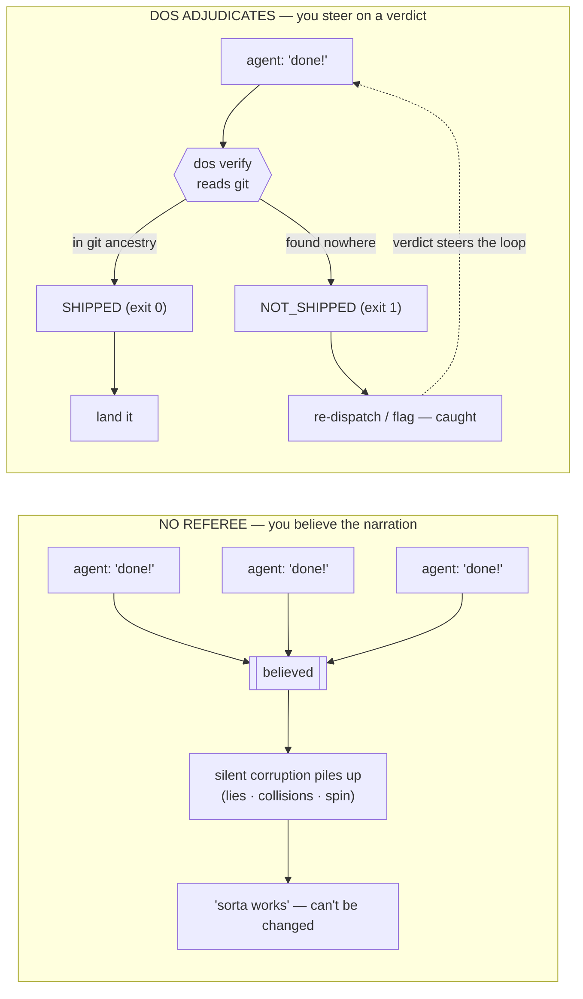

# Why a referee — the case, the evidence, the boundaries

> ← Part of the [DOS README](https://github.com/anthony-chaudhary/dos-kernel/blob/master/README.md). This is the long form of "why add a referee at all": the plain-words story, why a 20-line script isn't enough, what's actually proven, and what DOS deliberately does *not* do.

## The plain-words version

A coding agent does some work, then tells you how it went. Usually the story is
true. Sometimes it isn't — the cheerful *"all work completed!"* from a worker
that actually shipped nothing is one of the most common, and most expensive,
failures in agent fleets. With one agent you catch that yourself, because you read its work
before trusting it — which is a real cost you're already paying, you just
haven't called it one: re-reading the output is the tax for taking the report
on faith.

Run twenty agents at once and that tax stops being payable — nobody reads
everything. Each worker grades its own homework, you believe the reports
because what else is there to go on, and
the unchecked problems pile up quietly — a false "done" here, two agents
overwriting the same file there, one worker spinning in circles burning money.
None of it is loud. The codebase ends up *sorta* working, and nobody can safely
change it.

DOS is the referee. It's a small, deterministic program that never reads the
agent's story; it reads what actually happened — the commit, the file, the
clock — and hands you a verdict. An agent says "done"? DOS checks whether the
work really landed in your repo's history. An agent says "making progress"?
DOS checks whether anything real has changed. Two agents head for the same
files? DOS admits one and refuses the other, with a reason a machine can act
on. Every verdict is computed from artifacts the agent didn't author, so no
amount of confident narration can move it.

Nothing about it is coding-specific, and it imposes no framework. Your repo
declares its own rules — which file regions each agent may touch, how a
finished unit of work signals "done" — as data in one small config file, and
DOS supplies only the machinery. You reach it through small, do-one-thing
commands, through the agent host you already run, or straight from Python. And
it stays in its lane: it tells you reliably *what happened*, never whether the
committed code is *good* — quality stays with your tests, your reviews, and
you.

Adopting it costs one engineer about an afternoon: one small Python package
(one runtime dependency), one optional config file — and it works on day one
against a plain git repository with neither. If your team is about to go from
one agent to many, the missing piece is usually not a smarter agent. It's a
referee that doesn't believe any of them.

Convinced enough to watch it work? [Try it in 60 seconds](https://github.com/anthony-chaudhary/dos-kernel/blob/master/README.md#try-it-in-60-seconds)
is one command — or hand the README to whoever runs your agents.

## Why not just run N agents?

Fair question — why add a referee at all? Because N agents with no referee is
that open loop again: you launch them, they self-report, and you've got nothing
solid to steer on. DOS hands you that missing signal. Specifically, it gives
you **sensors** —

- `verify` — did it really ship? (from git, not the agent's word)
- `liveness` — is it ADVANCING, or just SPINNING / STALLED?
- `scope-gate` — did it stay in its lane? A binding pre-effect gate
  (`dos scope-gate`, ALLOW/REFUSE, exit 0/5/6) over the same `dos.scope`
  classifier that also reports post-hoc.

— and **actuators**: `arbitrate` (let this lane in, or refuse the collision) and
`refuse` (say no with a reason a machine can act on). Here is the same fleet
under both regimes:

<!-- Don't reference the diagram's left/right in prose. Mermaid decides where
     disconnected subgraphs land (GitHub stacks them vertically), so a positional
     caption is a claim about a render nobody verified — name the subgraph
     titles instead; those travel with the boxes wherever the renderer puts
     them. -->

The two regimes as a flowchart — <strong>NO REFEREE:</strong> you believe the narration; <strong>DOS ADJUDICATES:</strong> you steer on a verdict

*Prefer to watch it move?* The two loops are also a self-contained animation you
step through one frame at a time — clone the repo and open
[`docs/assets/loop_visual.html`](https://github.com/anthony-chaudhary/dos-kernel/blob/master/docs/assets/loop_visual.html) in a browser. (It's an
HTML file, so GitHub shows its source rather than running it — open it locally.)

Together they turn a pile
of workers into something you can actually drive. The kernel's job is the
signal, but it also ships a reference supervisor to show what you do with it:
`dos watch` checks `liveness` on each tracked run and *proposes* a halt when one
spins or blows its budget — it recommends, it never pulls the trigger — and
`dos loop` keeps N dispatch-loops alive. Use those, or build your own on the
same signal. Either way, it's the difference between *"I launched 20 sessions
and I'm hoping"* and *"I can see which two are lying and which one is wedged."*

You see that signal through three read-only screens — `dos top` (what's
running), `dos decisions` (what's waiting on you), `dos plan` (claim vs. ground
truth) — covered in [Three live projections](./cli-reference.md#three-live-projections-read-only-tuis)
and walked end-to-end in
**[Debug a stuck fleet](https://github.com/anthony-chaudhary/dos-kernel/blob/master/examples/playbooks/06_debug-a-stuck-fleet.md)**.

### "I could write this in 20 lines of bash"

You could — and that instinct is correct. The core of `dos verify` really is
"grep git history for a stamp." DOS is that script taken seriously across the
six places the 20-line version quietly breaks:

1. **The stamp grammar is forgeable** unless it's a *closed, declared*
   vocabulary the agent can't widen on the fly — a bare grep believes any
   string the agent learns to print.
2. **Concurrent agents need a crash-safe lease journal**, not a grep: deciding
   whether two workers may touch the same tree is arbitration, and it has to
   survive a kill mid-write.
3. **"Spinning vs. stalled" is a failure detector with FLP edges**, not a
   timeout — a wedged run and a slow-but-live one look identical to `sleep`.
4. **One verdict shape has to render byte-identically across hosts** to be a
   standard a fleet can depend on, instead of a different ad-hoc check per tool.
5. **A skeptic-checkable signed receipt** (`dos attest`) is something a bash
   script the agent's own host runs simply cannot mint.
6. **`commit-audit` (claim-vs-diff) isn't greppable** — it reads what the diff
   *did* against what the subject *said*.

The load-bearing point under all six: a script your agent's own host runs can't
credibly be *the part that doesn't believe the agent*. The whole value is being
the layer that is structurally not talked past — and that's exactly the thing a
home-grown check, run inside the loop it's auditing, can't be.

This also answers the most sophisticated objection — **"doesn't durable
execution (Temporal) already do this?"** Durable execution guarantees the step
*ran* and durably records what it *returned*; if an agent step returns
`"deployed successfully"`, the history correctly records that the step *said
so*. DOS adjudicates exactly that residue: the claim against the world. They're
orthogonal layers. (The full comparison — evals, guardrails, in-toto, CI — is
in **[docs/ALTERNATIVES.md](https://github.com/anthony-chaudhary/dos-kernel/blob/master/docs/ALTERNATIVES.md)**.)

The referee grows along two axes: deterministic *verdicts* that read artifacts
(`verify`, `liveness`, `scope`), and provider-backed *judges* — a model, a
debate — that rule on what no deterministic check can, kept outside the kernel
under a discipline that stops a wrong judge from clearing a falsehood. See
**[the adjudicator-population note](https://github.com/anthony-chaudhary/dos-kernel/blob/master/docs/88_the-adjudicator-population.md)** for
that scalable-oversight story in code.

> **We caught ourselves doing the exact thing DOS exists to catch.** A design doc
> in this repo included a small worked example — "here's what this snippet prints" —
> written by the agent building DOS. It read perfectly plausible. It was reviewed. It
> was committed. And it was wrong, for the dullest possible reason: *nobody had
> actually run it.* The agent had reasoned out what the code "would" print and typed
> that down as fact. An adversarial review later did the one thing the author hadn't
> — executed the snippet — and the real output flatly contradicted the prose.
> That's the whole thesis in one anecdote: a confident narration is not evidence,
> even when the narrator is us, even after a human reviewed it. The reasoning felt
> like checking; it wasn't. The only thing that settled it was running the code and
> reading what came back — an independent witness, exactly the move `verify` makes
> against an agent's "done." The correction is pinned in git (`docs/124`, commit
> `651ba03`), because here too the record is the commit, not the claim.

> **And the first issue ever filed on this repo was closed the same way.**
> [Issue #1](https://github.com/anthony-chaudhary/dos-kernel/issues/1) is the
> publish pipeline's TestPyPI rehearsal failing its OIDC token exchange
> (`invalid-publisher`). The bug is ordinary; the closure is the demo. It wasn't
> closed on "fixed it" narration — it was closed on two read-backs the claimant
> didn't author: the next pipeline run's own conclusion
> ([the dry-run leg, green](https://github.com/anthony-chaudhary/dos-kernel/actions/runs/27309748423))
> and [the registry's own JSON](https://test.pypi.org/pypi/dos-kernel/json)
> reporting the artifact that leg exists to land. The closing comment runs the
> kernel's verdict on itself — `dos reward --claim --witness confirm` →
> **ACCEPT** — and the same evening, the same pipeline's witness gate
> [refused to publish release 0.23.0](https://github.com/anthony-chaudhary/dos-kernel/actions/runs/27310760144)
> because CI was red on the candidate commit: a release pipeline declining to
> believe an unwitnessed "ready." Every link is public — click the runs, read
> the registry JSON, audit the closure yourself.

## What's proven and what's still a bet

We apply the same honesty to our own claims that the kernel applies to your
agents. It would be easy to lead with one big number; instead, here's the
split — what we actually measured, what we extrapolated from those
measurements, and what is still a bet. Draw the line yourself. (Every *proven*
number is from a live, re-runnable benchmark written up under
[`benchmark/`](https://github.com/anthony-chaudhary/dos-kernel/tree/master/benchmark) and the paper.)

**✅ Proven — measured in live runs, scored against a fact the agent can't fake**
(a test environment's database state, git history — bytes the agent wrote none of):

- **It catches the lie and blocks it.** Across 120 clean tasks on a standard
  agent benchmark, a DOS gate caught 10 genuine "I shipped it" lies and let
  every honest write through — at the same 8.3% catch rate on both a mid-size
  and a top-tier model. The signal doesn't fade when you upgrade the model.
  (Over the full benchmark: 15 lies caught in 258 tasks, two models, zero false
  alarms.) *(▶ the catch itself is the [gate figure below](#the-two-money-moments-rendered).)*
- **It prevents the collision.** The same referee put two live agents on one
  shared record and stopped 6 of 8 cases of one silently overwriting the other
  — 4 of 6 when the cases were drawn from the real task mix. This is the half a
  sandbox *can't* cover: an isolated workspace still shares the outside world.
  *(▶ the collision being prevented is the [coordination figure below](#the-two-money-moments-rendered).)*
- **Mid-run "fixes" don't help; quitting a doomed run does.** Every active fix
  we tried mid-run (warn it, rewind it, inject a hint) came out flat-to-negative
  — poking a run also disturbs the ones that would have passed. The one move
  that helps writes nothing: give up at the right moment — 0 runs wrongly
  killed out of 1,634 winners across 22 models, ~11% of fleet compute saved.
- **The training label can't be gamed.** For "may a fine-tune learn from this
  run?" (`dos reward`), the yes/no is computed from environment state the agent
  authored none of — so no amount of clever output text can flip a *no* to a
  *yes*. That's a proof, plus a measured 60% → 100% precision lift from
  filtering out the poison a naive self-graded collector would have kept.

The two proven moments above, each rendered as a single figure from its own live
run (every number, hash, and ID is a verbatim read-off — never a hand-typed
dramatization):

  
   
  <em><strong>It catches the lie and blocks it.</strong> A confident booking, refuted by the DB-hash the agent couldn't author, blocked before a downstream agent inherits the phantom. <a href="https://github.com/anthony-chaudhary/dos-kernel/blob/master/benchmark/agentprocessbench/writeadmit/gate_visual.html">Step through it locally</a> (an HTML walkthrough — clone and open in a browser; GitHub shows its source).</em>

  
   
  <em><strong>It prevents the collision.</strong> A stale add-bag clobbers a cancellation under naive replay; the arbiter serializes the two agents on the same region so neither overwrites the other. <a href="https://github.com/anthony-chaudhary/dos-kernel/blob/master/benchmark/agentprocessbench/writeadmit/f2_visual.html">Step through it locally</a> (an HTML walkthrough — clone and open in a browser).</em>

**📈 Projected — real measurements, composed into a curve (and labelled as one).**
Here's the crux: catching a lie is only worth something to whoever can't catch
it themselves. Hand the verdict to one strong agent that re-checks its own
inputs and it buys you almost nothing — that agent recovers on its own. Hand it
to something that *can't* re-check — a non-LLM system, a weaker model, a long
multi-step chain, or a training loop — and it pays off (up to a full +1.0 in
our no-recovery upper bound). In short: DOS is worth more the less your
downstream can check itself. Our fleet-scale figure (≈173–505 corrupted results
prevented at a 32-agent fleet) projects these real per-run rates onto fleet
math — it's geometry on top of measured numbers, not a measured fleet run.

**🎲 A bet — stated as one.** Where this goes if the floor holds: a frozen,
cross-vendor trust standard (the "deny" message already renders from one
verdict across every wired host, and is byte-identical on the ones that share
Claude Code's envelope — Codex and Claude Cowork, pinned in
`tests/test_hook_dialect.py` — a de-facto standard waiting to be named),
a shared arbiter for real-world effects, the claim-vs-reality corpus only a
neutral party can hold, and a notary that proves what an agent did *to a
skeptic who wasn't in the room* (the mechanism already ships — `dos attest`
mints an HMAC-signed receipt over an effect-witness verdict and
`dos verify-receipt` checks it with the shared key alone;
[docs/246](https://github.com/anthony-chaudhary/dos-kernel/blob/master/docs/246_dos-attest-the-portable-signed-receipt.md)). The seeds are
in the tree; we claim no results for any of it.

> **The one distinction that keeps this honest:** a **J** is a *count of failures
> blocked off ground truth* — never a downstream outcome delta. "Blocked 10 real
> over-claims" is proven; "made the fleet 10% better" is not the same sentence,
> and we don't write it.

## What DOS does *not* do

The proven/bet gradient above is about *evidence*; this is about *capability* —
the boundaries are part of the contract, and stating them is the same honesty
the kernel applies to your agents:

- **It adjudicates that a ship *happened*, not that the code is correct or good.**
  `verify` reads git ancestry, so it catches "no commit landed," not "the
  committed work is wrong." Judging *quality* is the JUDGE / HUMAN rung, not the
  deterministic oracle.
- **It computes verdicts and admission decisions; it never spawns or kills an OS
  process.** `liveness` is advisory — it *reports* SPINNING, it doesn't stop the
  run — and `dos loop` *emits* a spawn/reap/flag plan you act on. (`arbitrate` and
  `refuse` are decisions you enforce, not force the kernel applies.)
- **It is not a CI replacement or a test runner.** It sits *beside* them and lets a
  step branch on the exit-code verdict.
- **The pluggable verdict/JUDGE adjudicator *registry* is specced, not yet
  shipped** (see [docs/88](https://github.com/anthony-chaudhary/dos-kernel/blob/master/docs/88_the-adjudicator-population.md) §5); the JUDGE
  *seam* and built-in judges are.

---

*Next: [wire it into your stack](./wire-it-in.md) · [the full syscall + CLI reference](./cli-reference.md) · [the research on-ramp](./for-researchers.md).*
