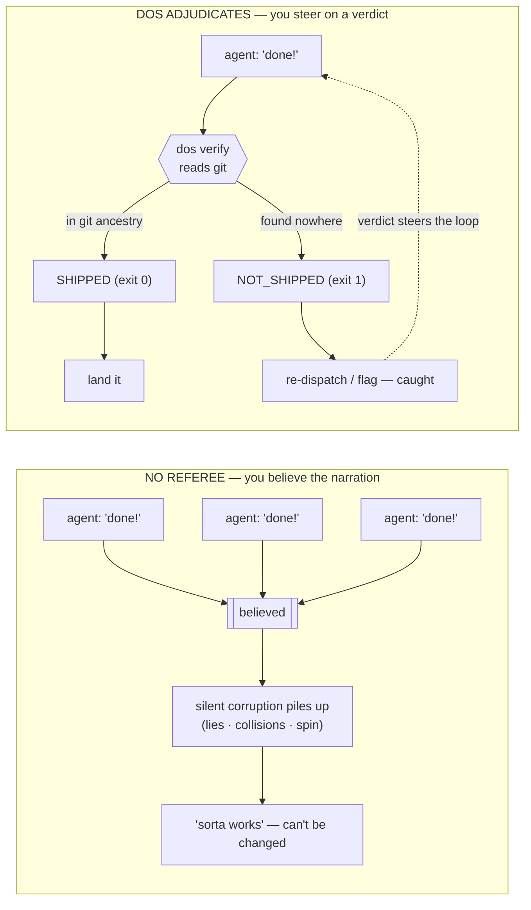

## What goes wrong in a fleet

Run a pile of agents at once with nobody refereeing, and here's how it goes:
each worker reports its own success, and you believe the reports, because what
else is there to go on? The unchecked problems pile up quietly — a lie here,
two agents clobbering the same file there, a little scope creep, one worker
spinning in circles — until the codebase *sorta* works and nobody can safely
change it.

The trouble is you launched the agents and then let them grade their own
homework. DOS gives you the missing signal — a verdict from ground truth — so
the loop closes. Here is the same fleet under both regimes:

<!-- Don't reference the diagram's left/right in prose. Mermaid decides where
     disconnected subgraphs land (GitHub stacks them vertically), so a positional
     caption is a claim about a render nobody verified — name the subgraph
     titles instead; those travel with the boxes wherever the renderer puts
     them. -->

The two regimes as a flowchart — <strong>NO REFEREE:</strong> you believe the narration; <strong>DOS ADJUDICATES:</strong> you steer on a verdict

Here are the failures a fleet actually produces, each next to the ground truth
that quietly contradicts the worker's story — and the verdict DOS hands back:

| A worker… | …but the ground truth is | DOS verdict |
|---|---|---|
| says it shipped a unit of work | no commit ever landed | `verify` → **caught lie** |
| tried, but the commit silently failed | no commit ever landed | `verify` (the flake — indistinguishable from a lie *without* git) |
| edits files another worker owns | two agents, one shared file | `arbitrate` → **refuse** the second |
| overruns the file region it claimed | footprint reaches beyond the declared tree | `scope-gate` → **REFUSE** (before the write lands) |
| reports "making progress" | 0 commits, only a fresh heartbeat | `liveness` → **SPINNING** |

The first row is the most common one. The classic tell is a cheerful one-liner,
*"all work completed!"*, from a worker that did little or nothing. DOS never
reads that line; it reads the ground truth, so the claim collapses the instant
no artifact backs it (more in
[docs/108](https://github.com/anthony-chaudhary/dos-kernel/blob/master/docs/108_the-cheap-lie-and-the-narration-taxonomy.md)). That's also
what makes it cheap to adopt: `verify` needs no plan, no registry, no config,
and the exit code *is* the verdict — any shell or CI step can branch on it
without parsing a word.

*Prefer to watch it move?* The two loops are also a self-contained animation you
step through one frame at a time — clone the repo and open
[`docs/assets/loop_visual.html`](https://github.com/anthony-chaudhary/dos-kernel/blob/master/docs/assets/loop_visual.html) in a browser. (It's an
HTML file, so GitHub shows its source rather than running it — open it locally.)

### How far you take it

It works on a plain `git init` with zero config, and gets smarter the more you
tell it. You don't adopt a framework and pick a tier; you start at the shallow
end and it keeps paying off as you wade deeper — the same kernel the whole way:

- **Zero config.** Point `dos verify PLAN PHASE` at a plain git
  repo — no plan, no registry, no `dos.toml`. It answers from commit history
  alone (`via grep-subject` / `via none`). This is the whole of
  [QUICKSTART](https://github.com/anthony-chaudhary/dos-kernel/blob/master/docs/QUICKSTART.md) and the day-one CI win above.
- **Tell it your structure.** `dos init` writes a `dos.toml` (lanes, paths,
  ship grammar as data); add a plan doc and `dos plan` lays each phase's
  *claim* beside the oracle's verdict. Here's [exactly what a plan file looks
  like](https://github.com/anthony-chaudhary/dos-kernel/blob/master/examples/plans/example-plan.md) (copyable, round-trips with the built-in
  reader), and four worked [example workspaces](https://github.com/anthony-chaudhary/dos-kernel/tree/master/examples/workspaces).
- **Teach it your own types.** Declare your own block reasons, gate
  verdicts, output renderers, admission predicates, a model-backed judge, a
  custom plan dialect, or a whole host driver — all as workspace policy,
  never a fork. The map is **[docs/HACKING.md](https://github.com/anthony-chaudhary/dos-kernel/blob/master/docs/HACKING.md)** (seven extension
  axes) + the copy-me **[`examples/dos_ext/`](https://github.com/anthony-chaudhary/dos-kernel/tree/master/examples/dos_ext)**.

### How you plug it in

That slope is how deep your config goes. The other axis is how you call the
referee at all — and you adopt through whichever surface matches how you
already work, not by restructuring your stack. The same kernel verdicts are
reachable through every row here, lowest-friction first:

| Surface | Adopt it when… | The move |
|---|---|---|
| **MCP server** | you drive an agent through an MCP host (Claude Desktop, Cursor, Cline, an Agent-SDK app) | add one line to the host config (`{ "command": "dos-mcp" }`) and ask the agent to `dos_verify` its own last claim — **zero code**. The *advisory* path (the agent asks). See [Give your agent a lie detector](#give-your-agent-a-lie-detector-mcp). |
| **Runtime hooks** | you run an agent loop (Claude Code, Cursor, Codex CLI, Gemini CLI) and want the verdict to *act*, not just be available | `dos init --hooks <runtime>` wires the verdict into that host's own hook config — a refused call is **denied before it runs**, a false "done" is **refused**. The *enforcement* path (the host denies). One command, no hand-edited YAML. See [QUICKSTART](https://github.com/anthony-chaudhary/dos-kernel/blob/master/docs/QUICKSTART.md) + [docs/221](https://github.com/anthony-chaudhary/dos-kernel/blob/master/docs/221_the-cross-vendor-hook-installer.md). |
| **CLI exit-code** | you have a shell pipeline or CI step that trusts an agent's "done" | replace that step with `dos verify PLAN PHASE` and branch on the exit code (`0` shipped / `1` not) — **the verdict *is* the exit code**. The day-one win above. |
| **Python API** | your dispatcher/orchestrator is already Python | `import dos` and call the pure syscalls (`dos.oracle.is_shipped`, `dos.arbiter.arbitrate`, …) — state-in / verdict-out, no subprocess. The [Python cookbook](https://github.com/anthony-chaudhary/dos-kernel/blob/master/examples/playbooks/cookbook-python-api.md). |
| **Fleet framework** | your fleet already runs on LangGraph, CrewAI, AutoGen, or the OpenAI/Claude Agents SDK | bolt the referee onto the framework's own seam — a referee node, a termination condition only git can satisfy, an output guardrail with a git tripwire. One function, no rewrite; every seam executed against the real framework. The [fleet-framework cookbook](https://github.com/anthony-chaudhary/dos-kernel/blob/master/examples/playbooks/cookbook-fleet-frameworks.md). |
| **Swarm runtime** | your agents run on **Hermes, OpenClaw**, or a SwarmClaw-style autonomous swarm — privileged tools, shared memory docs / task boards, and **no lock manager** for either | drop a two-function adapter into the tool-execution loop: `guard_action` refuses an arbitrary-exec command **before it runs**, and `acquire_lease` / `release_lease` bracket each shared-state write so the lost update never lands. No `import dos` — it shells the CLI; Hermes' `pre_tool_call` hook also speaks DOS natively (`dos hook pretool --dialect hermes`). The runnable, A/B-measured [Hermes / OpenClaw worked example](https://github.com/anthony-chaudhary/dos-kernel/tree/master/examples/hermes_integration) + [docs/278](https://github.com/anthony-chaudhary/dos-kernel/blob/master/docs/278_integrating-dos-with-hermes-and-openclaw-the-missing-lock-manager-for-agent-swarms.md). |
| **Skill pack** | you run agents in Claude Code and want the workflow, not just the verdict | `dos init --skills` drops editable `SKILL.md` screenplays that wire the syscalls into a snapshot → audit → gate → take-a-lane loop. See [QUICKSTART §2](https://github.com/anthony-chaudhary/dos-kernel/blob/master/docs/QUICKSTART.md). |
| **Driver** | your lanes must be *computed*, or you add a provider-backed judge | write one `dos/drivers/<host>.py` (a `LaneTaxonomy` + a config factory), loaded by name, never imported by the kernel. The map is [HACKING.md](https://github.com/anthony-chaudhary/dos-kernel/blob/master/docs/HACKING.md). |

The two axes are independent: a zero-config repo can adopt through any surface,
and a deeply-configured one still answers over the same CLI and MCP tools.
Start at the top row — it's the one that costs nothing to try. The first two
rows also compose: MCP advises (the agent checks its own work), hooks enforce
(the host stops a bad action) — wire both for the full loop.

Those surfaces are the upstream half of the value chain — who calls the
referee. The same verdicts also flow downstream, to the systems that act on
them: every adjudication lands in a verdict journal that `dos export` drains to
your observability stack (Datadog / Honeycomb / Grafana —
[docs/266](https://github.com/anthony-chaudhary/dos-kernel/blob/master/docs/266_the-verdict-exporter-shipping-the-journal-to-where-dashboards-live.md)),
`dos notify` pushes what-needs-a-human to Slack, `dos reward` gates what a
fine-tune may train on, and `dos attest` mints a signed receipt a skeptic can
check without loop access
([docs/246](https://github.com/anthony-chaudhary/dos-kernel/blob/master/docs/246_dos-attest-the-portable-signed-receipt.md)). One kernel, one
verdict vocabulary, from the agent's tool call to your dashboard.
