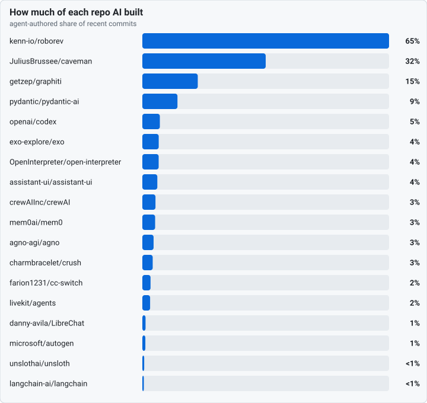
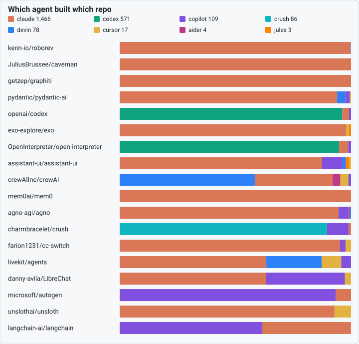
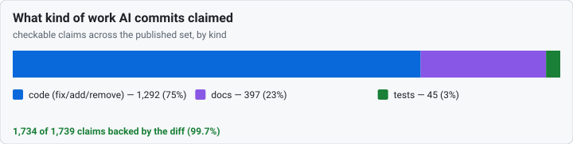

# How AI built the software you already use

Agents now write a real share of the popular open-source projects you depend on — and they write their own commit messages too. This board looks at the recent history of well-known repos and asks three plain questions: **how much of it did AI write, which agent did it, and what kind of work was it** — fixes, tests, docs.

The catch is that a commit *message* is just text the agent typed; the **diff** is what git actually recorded, and the two can disagree. So every number here is checked against the diff, never the message alone. That is the difference between this board and a star count: it reads the thing that can't be talked up.

## The picture

Three views of the same audited history. Every figure is generated from the committed per-repo data — no live calls, reproducible offline by anyone who clones the repo.







> Across these **19 repos**, **claude** is the most prolific agent — it wrote **63%** of all the AI-authored commits here, with **7** other toolchains sharing the rest, and **75%** of what they all claimed was shipping code, not tests or docs.

## Score your own repo in one command

```bash
pip install dos-kernel
dos commit-audit --sweep --workspace . BASE..HEAD
```

That is the exact same check the board runs, on your history — before you trust the next "done". No account, no upload, no one named.

## Start here — the auditor grades itself

We ran the check on our own repo first and published whatever it said. It says **non-zero** — a few deliberate empty re-stamp commits, whose subject re-anchors a plan after a renumber, so the claim rests on the subject text alone by house convention. The page shows each one, and the methodology explains why the auditor is right to count them. We left them in. A scoreboard that airbrushed its own page to zero wouldn't be worth reading.

- **[anthony-chaudhary/dos-kernel](anthony-chaudhary/dos-kernel.md)** — our own grade, every flag explained.

## Repo by repo

The detail behind the charts — each repo's AI-built share, the agents that did it, and whether every checkable claim was backed by its own diff. Sorted by AI-built share. Click a repo for the full receipt.

| Repo | AI-built | Agents | Claims checked | Backed |
|---|---|---|---|---|
| [kenn-io/roborev](kenn-io/roborev.md) | 65% | claude 430 · copilot 1 · cursor 1 | 273 | 100% |
| [JuliusBrussee/caveman](JuliusBrussee/caveman.md) | 32% | claude 65 | 49 | 100% |
| [getzep/graphiti](getzep/graphiti.md) | 15% | claude 127 | 66 | 100% |
| [pydantic/pydantic-ai](pydantic/pydantic-ai.md) | 9% | claude 188 · devin 7 · copilot 4 · … | 139 | 100% |
| [openai/codex](openai/codex.md) | 5% | codex 331 · claude 10 · copilot 3 | 155 | 100% |
| [exo-explore/exo](exo-explore/exo.md) | 4% | claude 99 · cursor 1 · jules 1 | 67 | 100% |
| [OpenInterpreter/open-interpreter](OpenInterpreter/open-interpreter.md) | 4% | codex 240 · claude 10 · copilot 3 | 118 | 100% |
| [assistant-ui/assistant-ui](assistant-ui/assistant-ui.md) | 4% | claude 119 · copilot 12 · devin 2 · … | 79 | 100% |
| [crewAIInc/crewAI](crewAIInc/crewAI.md) | 3% | devin 51 · claude 29 · aider 3 · … | 69 | 100% |
| [mem0ai/mem0](mem0ai/mem0.md) | 3% | claude 77 | 66 | 100% |
| [agno-agi/agno](agno-agi/agno.md) | 3% | claude 159 · copilot 7 · aider 1 · … | 103 | 100% |
| [charmbracelet/crush](charmbracelet/crush.md) | 3% | crush 86 · copilot 9 · claude 1 | 50 | 100% |
| [farion1231/cc-switch](farion1231/cc-switch.md) | 2% | claude 40 · copilot 1 · cursor 1 | 30 | 100% |
| [livekit/agents](livekit/agents.md) | 2% | claude 45 · devin 17 · cursor 6 · … | 58 | 100% |
| [danny-avila/LibreChat](danny-avila/LibreChat.md) | 1% | claude 24 · copilot 13 · cursor 1 | 24 | 100% |
| [microsoft/autogen](microsoft/autogen.md) | 1% | copilot 28 · claude 2 | 27 | 100% |
| [unslothai/unsloth](unslothai/unsloth.md) | <1% | claude 26 · cursor 2 | 22 | 100% |
| [langchain-ai/langchain](langchain-ai/langchain.md) | <1% | copilot 24 · claude 15 | 29 | 100% |
| [anthony-chaudhary/dos-kernel](anthony-chaudhary/dos-kernel.md) | — | — | 315 | 98% |

## The fine print (it matters)

**A mismatch is not an accusation.** It does not mean the code is wrong, or that anyone lied. It means one thing only: a commit's subject claimed something its own diff doesn't show. A real fix to the wrong bug passes the check; an honest doc cleanup with a sloppy subject can flag. A message-vs-diff mismatch is **never** a correctness, honesty, or intent grade — only a note that a commit's words and its own diff disagree.

- **[How it works](methodology.md)** — exactly what the check reads, what it skips, and every time the check itself was wrong (we narrow the check, never trust the subject).
- **[The big picture](report-2026-06.md)** — the population mismatch rate across public repos, with every flag hand-checked and denominators everywhere.
- **[The live roll-up](rollup.md)** — the published set above, folded into one aggregate by `scripts/scoreboard_rollup.py`. Every number is derived from the committed per-repo data, reproducible offline.
- **Want your repo listed?** Clean or not, it's opt-in and you see the result before it publishes. See the methodology's registration section.

The pages above are the 19 repos we've audited and named. A repo is named only when its verdict is published; a non-clean or unadjudicated verdict is reported only as a count, never as a named page ([docs/311](../311_scoreboard-per-repo-index-plan.md) §2).

> The kernel is the part that doesn't believe the agents.
